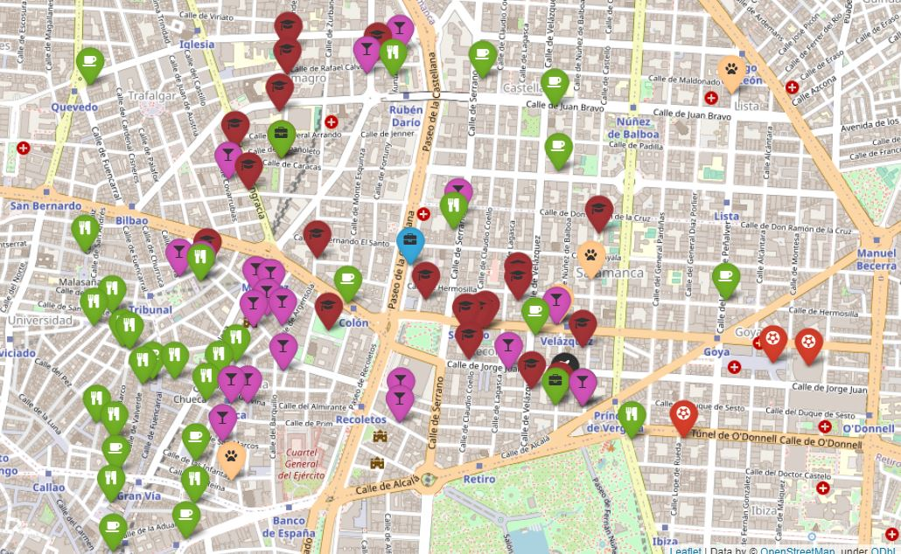

# Geospatial project:

The goal of this project is to find the best option to deploy a new office in Spain. This new company has an structure and each person in it has some criterias to be meet for this new office. 

Some particulary needs:
- 20 Designers (near design companies)  
- 20 Account Managers (near aiports)
- 15 Data Engineers
- 10 Frontend Developers (near 1M startups)
- 10 Executives (near Starbucks)
- 5 Backend Developers (near 1M startups)
- 5 UI/UX Engineers 
- 1 Maintenance guy that loves basketball (10km near basketball stadiums)
- 1 CEO/President (near vegan restaurants)

General needs:
- 30% near to child schools
- Near places to party
- Near dog hairdresser (not too far away)

During this project i worked with MongoDB to find the first list of posbile locations for this office within Spain territory and then i've use Google Maps API to define the best place based on previous choosen criteria.

This project has 3 stages well defined:
1. MongoDb querying and cleaning
2. Analyze data
3. Visualization

## Files structure:

- "data" folder with:
    - JSON file from the MongoDB querying and cleaning (spain-companies.JSON)
    - JSON file with all Spain offices and score of each condition (selections.JSON)
    - JSON file with the new office locations and all the complement locations to fullfil the conditions (final_places.JSON)
- "notebooks" folder: 
    - Jupyter Notebook file (google_api.ipynb): Tests with Google Maps API.
    - Jupyter Notebook file (weight_matrix.ipynb): Tests creating a weight matrix.
- "src" folder with:
    - Python file with all the functions used in this project (functions.py)
- "image" folder with:
    - Coverpage image (portada.jpg)
    - Map with offices around Spain (map-big.jpg)
    - Map with the new office and all people conditions (map-extended.jpg)
- MongoDB querying and dataframe cleaning Jupyter Notebook file (mongo_and_cleaning.ipynb)
- Analysis Jupyter Notebook file (analysis.ipynb)
- Visualization Jupyter Notebook file (visualization.ipynb)

## Library used:

- Pandas - <https://pandas.pydata.org/>
- Pymongo - <https://pymongo.readthedocs.io/en/stable/>
- Folium - <http://python-visualization.github.io/folium/>
- JSON - <https://docs.python.org/3/library/json.html>
- Requests - <https://docs.python-requests.org/en/master/>

## APIs used:

- Google Maps API - <https://developers.google.com/maps>

## DB used:

- MongoDB - <https://www.mongodb.com/>

## Choosen location (SPOILER ALERT!):

